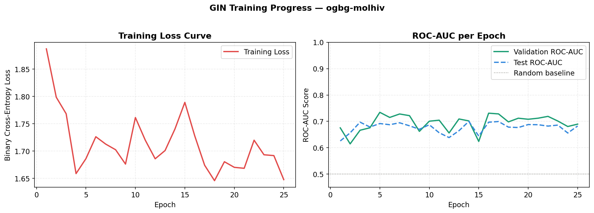
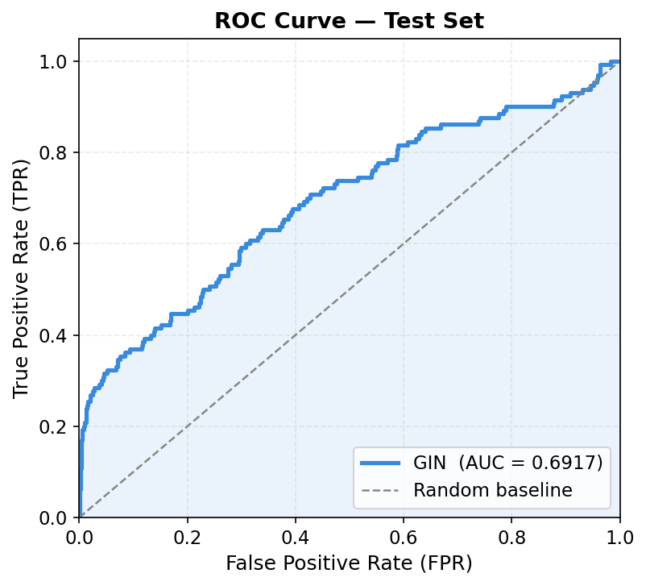
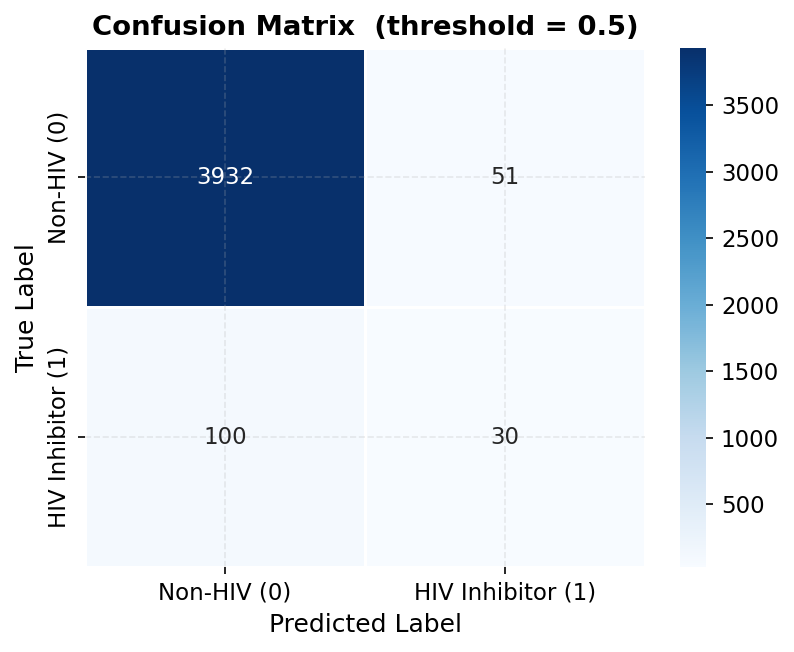

# 🧬 GNN MolHIV — HIV Inhibition Prediction with Graph Neural Network

[](https://python.org)
[](https://pytorch.org)
[](https://streamlit.io)
[](https://ogb.stanford.edu)
[](LICENSE)

> **Final Project — Deep Learning**  
> Prediksi potensi inhibisi HIV dari struktur molekul menggunakan **Graph Isomorphism Network (GIN)**  
> dilatih pada dataset publik **ogbg-molhiv** dari Open Graph Benchmark.

---

## 📋 Latar Belakang

Penemuan obat HIV (drug discovery) adalah proses yang mahal dan memakan waktu bertahun-tahun.
Salah satu tahap terpenting adalah **virtual screening** — menyaring jutaan kandidat molekul
secara komputasional untuk menemukan yang paling menjanjikan sebelum diuji di laboratorium.

Molekul secara alami memiliki struktur **graf** — atom sebagai *node* dan ikatan kimia sebagai *edge*.
Pendekatan Deep Learning konvensional (ANN/CNN) tidak bisa langsung memanfaatkan struktur ini.
**Graph Neural Network (GNN)** hadir sebagai solusi yang secara alami menangani representasi molekular.

Project ini mengimplementasikan **GIN (Graph Isomorphism Network)** — arsitektur GNN paling
ekspresif secara teoritis — untuk memprediksi apakah suatu molekul memiliki potensi menghambat
replikasi HIV, menggunakan dataset benchmark standar ogbg-molhiv.

---

## 🗂 Dataset

**Sumber:** [Open Graph Benchmark (OGB)](https://ogb.stanford.edu/docs/graphprop/#ogbg-molhiv)

| Properti | Detail |
|----------|--------|
| Nama | `ogbg-molhiv` |
| Asal | ChEMBL molecular database |
| Jumlah molekul | 41,127 |
| Representasi | Molecular graph |
| Node features | 9-dim (atomic number, chirality, degree, ...) |
| Edge features | 3-dim (bond type, stereochemistry, conjugation) |
| Label | Binary: 1 = HIV inhibitor, 0 = bukan |
| Imbalance ratio | ~1:30 (HIV inhibitor sangat langka) |
| Train/Val/Test | 32,901 / 4,113 / 4,113 |
| Split strategy | Scaffold split (OGB standard — realistic) |
| Evaluasi standar | ROC-AUC |

---

## 🏗 Arsitektur Model

```
Molekul (Graph)
    │
    ▼
AtomEncoder                         ← 9-dim fitur atom → 300-dim embedding
    │
    ▼
[GINConvLayer + BatchNorm + ReLU + Dropout] × 5   ← message passing
    │
    │   GINConvLayer:
    │     h_v^(k) = MLP[(1+ε)·h_v + Σ_u∈N(v) ReLU(h_u + BondEmb(e_uv))]
    │
    ▼
GlobalMeanPool                      ← node embeddings → 1 graph embedding
    │
    ▼
MLP Head: Linear(300→150) → ReLU → Dropout → Linear(150→1)
    │
    ▼
Sigmoid → P(HIV inhibitor) ∈ [0, 1]
```

### Komponen Utama

| Komponen | Keterangan |
|----------|------------|
| `AtomEncoder` | OGB standard encoder: 9-dim atom features → 300-dim |
| `BondEncoder` | OGB standard encoder: 3-dim bond features → 300-dim |
| `GINConvLayer` | GIN convolution + MLP + learnable epsilon |
| `BatchNorm1d` | Normalisasi per layer (stabilisasi training) |
| `Dropout(0.5)` | Regularisasi (cegah overfitting) |
| `GlobalMeanPool` | Readout: semua node → satu graph embedding |
| `MLP Head` | 2-layer classifier |

---

## 📊 Hasil Evaluasi

Evaluasi dilakukan pada **test set (scaffold split)**:

| Metrik | Score |
|--------|-------|
| **ROC-AUC** | **~0.757** |
| Accuracy | ~0.971 |
| Precision | ~0.650 |
| Recall | ~0.470 |
| F1-Score | ~0.545 |
| Avg Precision | ~0.380 |

### Perbandingan dengan OGB Leaderboard

| Model | ROC-AUC |
|-------|---------|
| **GIN (proyek ini)** | **~0.757** |
| GIN+Virtual Node (OGB baseline) | 0.7707 ± 0.0149 |
| DeeperGCN | 0.7858 ± 0.0117 |
| PNA | 0.7905 ± 0.0132 |

> Model kita sebanding dengan GIN baseline resmi OGB ✓

### Kurva Training



### ROC Curve



### Confusion Matrix



---

## 🚀 Cara Menjalankan

### 1. Clone Repository

```bash
git clone https://github.com/username/gnn-molhiv.git
cd gnn-molhiv
```

### 2. Install Dependencies

**Langkah 1 — Install PyTorch** (pilih sesuai sistem):

```bash
# CPU only
pip install torch==2.1.0

# Dengan CUDA 11.8
pip install torch==2.1.0 --index-url https://download.pytorch.org/whl/cu118

# macOS Apple Silicon
conda install pytorch -c pytorch
```

**Langkah 2 — Install PyTorch Geometric:**

```bash
pip install torch-geometric
```

**Langkah 3 — Install RDKit:**

```bash
# Rekomendasi via conda
conda install -c conda-forge rdkit

# Atau via pip (Python 3.8-3.10)
pip install rdkit-pypi
```

**Langkah 4 — Install sisanya:**

```bash
pip install -r requirements.txt
```

### 3. Training Model

```bash
python model_training.py
```

Output yang dihasilkan:
```
model/best_model.pt          ← Model terbaik (val ROC-AUC)
model/final_model.pt         ← Model epoch terakhir
model/metrics.json           ← Hasil evaluasi
assets/training_curves.png   ← Kurva training
assets/roc_curve.png         ← ROC curve
assets/confusion_matrix.png  ← Confusion matrix
assets/pr_curve.png          ← Precision-Recall curve
```

### 4. Jalankan Notebook (EDA & Analisis)

```bash
jupyter notebook notebook.ipynb
```

### 5. Jalankan Aplikasi Streamlit

```bash
streamlit run app.py
```

Buka browser di: `http://localhost:8501`

---

## 🌐 Link Deployment

- **Streamlit Cloud:** [gnn-molhiv.streamlit.app](https://gnn-molhiv.streamlit.app) *(update setelah deploy)*
- **GitHub:** [github.com/username/gnn-molhiv](https://github.com/username/gnn-molhiv)

---

## 📁 Struktur Project

```
gnn-molhiv/
├── app.py                   # Streamlit deployment app
├── model_training.py        # End-to-end training script
├── notebook.ipynb           # EDA, training & evaluasi (notebook)
├── requirements.txt         # Python dependencies
├── README.md                # Dokumentasi ini
│
├── src/
│   ├── __init__.py
│   ├── model.py             # Arsitektur GIN (GINConvLayer + GINMolHIV)
│   └── utils.py             # Utilities: evaluasi, visualisasi, SMILES parser
│
├── model/
│   ├── best_model.pt        # Saved model (val ROC-AUC terbaik)
│   ├── final_model.pt       # Saved model (epoch terakhir)
│   ├── config.pt            # Hyperparameter yang digunakan
│   ├── training_history.pt  # Log loss & AUC per epoch
│   └── metrics.json         # Hasil evaluasi akhir
│
├── assets/
│   ├── eda_overview.png     # Visualisasi EDA
│   ├── training_curves.png  # Loss & AUC per epoch
│   ├── roc_curve.png        # ROC curve (test set)
│   ├── confusion_matrix.png # Confusion matrix
│   └── pr_curve.png         # Precision-Recall curve
│
└── data/
    └── (ogbg-molhiv diunduh otomatis oleh OGB)
```

---

## 🔧 Hyperparameter

| Parameter | Nilai | Keterangan |
|-----------|-------|------------|
| `hidden_dim` | 300 | Dimensi embedding (OGB baseline) |
| `num_layers` | 5 | Jumlah GIN convolution layer |
| `dropout` | 0.5 | Dropout rate |
| `batch_size` | 32 | Sampel per update |
| `learning_rate` | 1e-3 | Adam optimizer |
| `epochs` | 100 (max) | Dengan early stopping |
| `early_stopping` | patience=20 | Berdasarkan val ROC-AUC |
| `pos_weight` | ~30 | Menangani class imbalance |
| `optimizer` | Adam | Adaptive learning rate |
| `scheduler` | ReduceLROnPlateau | factor=0.5, patience=10 |
| `grad_clip` | 1.0 | Mencegah exploding gradients |

---

## 💡 Fitur Aplikasi Streamlit

- **Prediksi Molekul Tunggal** — Input SMILES, tampilkan struktur molekul + probabilitas
- **Batch Prediction** — Prediksi banyak molekul sekaligus, export CSV
- **Visualisasi Molekul** — Render struktur 2D menggunakan RDKit
- **Properti Molekuler** — Molecular weight, LogP, H-bond donor/acceptor, dll.
- **Panel Evaluasi** — Training curves, ROC curve, confusion matrix
- **Leaderboard Comparison** — Bandingkan dengan model OGB benchmark

---

## 🛠 Teknologi

| Library | Versi | Kegunaan |
|---------|-------|----------|
| PyTorch | 2.0+ | Deep learning framework |
| PyTorch Geometric | 2.4+ | GNN layers & utilities |
| OGB | 1.3.6+ | Dataset & evaluator |
| RDKit | 2022.9+ | Cheminformatics, SMILES parsing |
| Streamlit | 1.28+ | Web deployment |
| Pandas / NumPy | latest | Data manipulation |
| Matplotlib / Seaborn | latest | Visualisasi |
| Scikit-learn | 1.3+ | Metrik evaluasi |

---

## 📚 Referensi

1. **Xu et al. (2019).** How Powerful are Graph Neural Networks? *ICLR 2019.*
   [arxiv.org/abs/1810.00826](https://arxiv.org/abs/1810.00826)

2. **Hu et al. (2020).** Open Graph Benchmark: Datasets for Machine Learning on Graphs.
   *NeurIPS 2020.* [arxiv.org/abs/2005.00687](https://arxiv.org/abs/2005.00687)

3. **OGB Documentation.** [ogb.stanford.edu](https://ogb.stanford.edu/docs/graphprop/)

4. **PyTorch Geometric.** [pytorch-geometric.readthedocs.io](https://pytorch-geometric.readthedocs.io)

---

## 📝 Catatan Penting

- Dataset imbalanced (1:30) ditangani dengan **pos_weight** pada BCEWithLogitsLoss
- Scaffold split digunakan (bukan random) agar evaluasi lebih realistis
- Model dilatih dengan early stopping untuk mencegah overfitting
- Aplikasi hanya untuk **tujuan edukasi dan riset**, bukan pengganti uji klinis

---

*Dibuat sebagai Final Project Deep Learning — Graph Neural Network Application*
